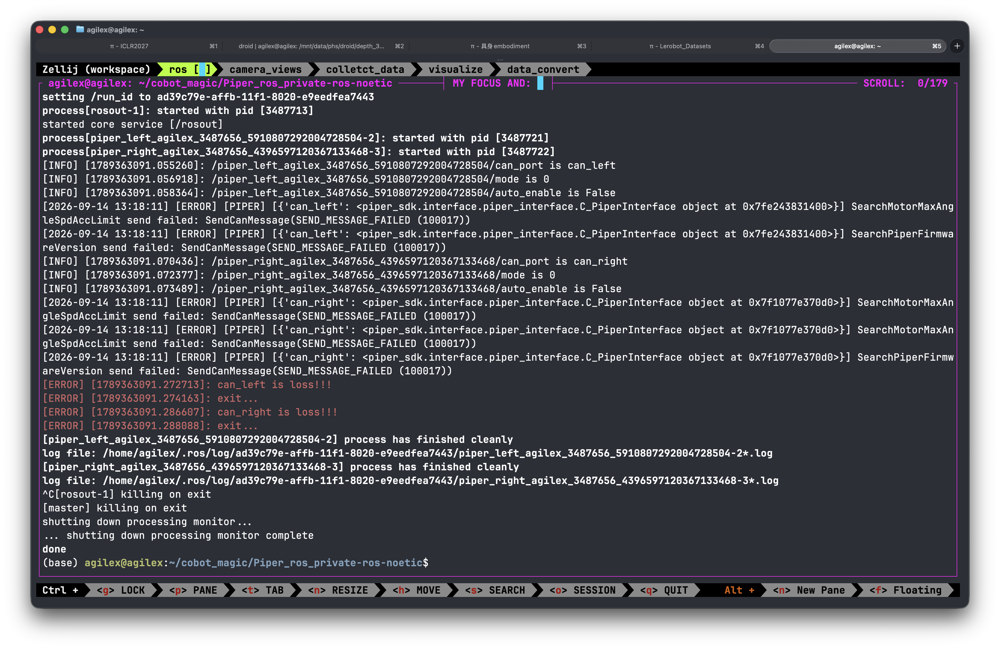

# 部署模型

## 前置知识： 同步推理和异步推理 (以下只是简短的介绍请自行查找其他资料)

本项目的策略（STAR-VLA 等 **VL/VLA**——视觉-语言(-动作) 模型）部署在 **server–client** 架构上（`server_policy.py` 即 PolicyServer，`dual_piper_deploy_*.py` 即 RobotClient）。要理解为什么有两种推理模式，先得理解现代策略普遍输出的「动作块」。

### Action Chunk（动作块 / 动作分块）

传统行为克隆（BC）每步只预测一个动作 $a_t$。而现代策略 $\pi$ 把当前观测 $o_t$ 一次性映射为一段未来 $H$ 步的动作序列：

$$\mathbf{A}_t = (a_t,\ a_{t+1},\ \dots,\ a_{t+H-1}) = \pi(o_t)$$

这段 $\mathbf{A}_t$ 就是一个 **action chunk**。机器人执行其中一部分后，再以最新观测重新查询一段重叠的新 chunk（**receding horizon / 滚动时域**），多段重叠部分常用 **temporal ensembling（时序集成）**——按指数权重 $\exp(-\Delta t/\tau)$ 融合——做平滑切换。**ACT、Diffusion Policy、OpenVLA、π0、SmolVLA、STAR-VLA** 等当前主流模型都输出 action chunk（可在 [LeRobot](https://github.com/huggingface/lerobot) 中跑通验证）。

为什么用 chunk 而非单步：

- **抑制误差累积（compounding error）**：单步 BC 每步误差会让机器人漂移到训练分布外的状态，下一步预测更差、雪崩式放大。一次预测 $k$ 步把独立决策点从 $T$ 降到 $T/k$（200 步轨迹、$k{=}100$ 时仅需 2~4 次决策）。
- **时序一致性 / 平滑性**：整段联合预测、联合计算 loss，迫使网络学到平滑的运动基元，而非帧间各自正确但互相矛盾的动作（类比语言模型一次生成多 token 比逐 token 采样更连贯）。
- **降低推理频率需求**：一次前向管多步，缓解大模型推理慢的瓶颈。

**chunk size $k$ 是最关键超参**，本质是「平滑 vs 响应」的权衡：

| 任务类型 | 推荐 $k$（50Hz 下≈秒数） | 说明 |
| --- | --- | --- |
| 桌面抓放（环境静态） | 50–100（1–2s） | 平滑性比响应更重要 |
| 装配 / 插装（接触丰富） | 30–60 | 需更频繁重规划以修正对齐 |
| 双臂协调 | 50–80 | 太短会破坏双臂协调 |
| 动态任务（抓/躲） | 10–20 | 响应优先，接受平滑损失 |

> $k$ 越大越平滑但越接近开环（环境变了也得等当前 chunk 执行完）；$k$ 越小响应越快，但重引入累积误差并失去平滑优势。

### 同步推理（Synchronous / Sequential Inference）

「算一步、走一步」的**阻塞式请求-响应**。控制循环为：

1. 采集观测 $o_t$；
2. 跑 $\pi(o_t)$ 得到 $\mathbf{A}_t$；
3. 把 $\mathbf{A}_t$ 入队、开始从队列取动作执行；
4. 队列空了就**等**下一个 chunk，否则重复步骤 3。

**核心问题：步骤 2 推理期间机器人空转（idle）。** 模型越大推理越慢，空转时间会主导单步交互时间（约 $1/\text{fps}$）。直接后果是：

- **任务完成变慢**——必须等下一个 chunk 算完才能继续；
- **响应性差**——有动作时几乎开环执行、没动作时彻底停转，失败后无法及时重规划。


### 异步推理（Asynchronous Inference）

核心思想：**把「动作预测」与「动作执行」解耦（decouple）**，分别跑在两个进程 / 两台机器上，让计算与执行在时间上重叠。

- **PolicyServer**：跑在加速硬件（GPU）上做批量推理，把 action chunk 发回去；
- **RobotClient**：机载运行，维护一个**动作队列（action queue）**，一边流式上传最新观测、一边执行队列里的动作；
- 新 chunk 到达后，与队列剩余部分在**重叠段聚合**：可「直接替换（replace）」或「加权融合（weighted blend）」，由自定义 `aggregate_fn` 控制。

流程：Client 持续流式发观测 → Server 推理时 Client 执行**当前队列** → 新 chunk 到达并入队 → 循环往复。结果是机器人**永远不等推理**、控制环更紧，实测约 **2× 任务完成加速**、成功率相当，且失败后能即时重规划。


## RTC-Anything (异步推理Client)

参考链接： https://github.com/Livioni/RTC-Anything

## 模型部署
下面的代码均在Agilex-aloha 真机上运行：

### 1. Camera

连接服务器，运行

```bash
zellij attach workspace
```

> **Zellij** 是一个用 Rust 编写的终端复用器（terminal multiplexer，类似 tmux / screen）：可在单个终端里管理多个窗格（pane）/标签页（tab）/窗口，会话在断开后仍然存活，可用 `zellij attach` 重新接入。上面的 `zellij attach workspace` 即重新接入名为 `workspace` 的已有会话，其中已预先排布好 camera / ros 等窗格。

!!! 请注意 退出zellij 请使用CTRL+O 然后按D !!!

!!! 请注意 退出zellij 请使用CTRL+O 然后按D !!!

!!! 请注意 退出zellij 请使用CTRL+O 然后按D !!!



连接服务器，运行

```bash
zellij attach workspace
```
打开 ros 窗口，左侧运行

```bash
cd ~/cobot_magic
bash tools/camera_serial.sh
```

测试通过后启动所有相机，并保持终端运行：

```bash
roslaunch astra_camera multi_camera.launch
```

右侧运行：

```bash
launch_camera
```
### 2. ROS

与 任务一 同一个 zellij，打开 ros 窗口

若重启电脑，需激活左右机械臂 CAN，否则可跳过此步：

```bash
cd ~/cobot_magic/Piper_ros_private-ros-noetic
bash can_muti_activate.sh --ignore
```

若采集数据：

```bash
roslaunch piper start_ms_piper.launch mode:=0 auto_enable:=false
```

若部署时：

```bash
roslaunch piper start_ms_piper.launch mode:=1 auto_enable:=true
```
### 3. 部署

部署需要联通 server(policy) 与 client(robot)


#### sever 端

```bash
zellij attach starvla

your_ckpt=checkpoints/your_path/your_ckpt.pt

python deployment/model_server/server_policy.py \
    --ckpt_path ${your_ckpt} \
    --port 8000 \
    --use_bf16
```


#### client 端

调整

``` bash
/home/agilex/Documents/phs/github/RTC-Anything/configs 
```

中 .yaml 文件 sever port 与对应的 client 文件的 port 一致，

client 文件位置: 

```bash
/home/agilex/Documents/phs/github/RTC-Anything/src
```

 使用时用 codex 根据 
 
```bash
 /home/agilex/Documents/phs/github/RTC-Anything/src/dual_piper_deploy.py
```
 
 的格式写一份针对当前模型的 client，调整端口一致

```text
请参考：

/home/agilex/Documents/phs/github/RTC-Anything/src/dual_piper_deploy.py

的代码结构和调用方式，为当前模型在同一目录下编写一份新的 client。

要求：
1. 保持 dual_piper_deploy.py 的整体部署流程和代码风格；
2. 根据当前模型修改模型输入、输出以及数据预处理/后处理；
3. 保留命令行 --port 参数；
4. client 连接的端口必须与 configs 中当前模型 .yaml 文件的 server port 一致；
5. 不要修改与当前模型无关的代码；
6. 新建 client 文件，不要直接覆盖 dual_piper_deploy.py。
```

随后运行

```bash
zellij attach rtc

uv run src/dual_piper_deploy_<your_model>.py --config configs/your/path.yaml --port 8000
```